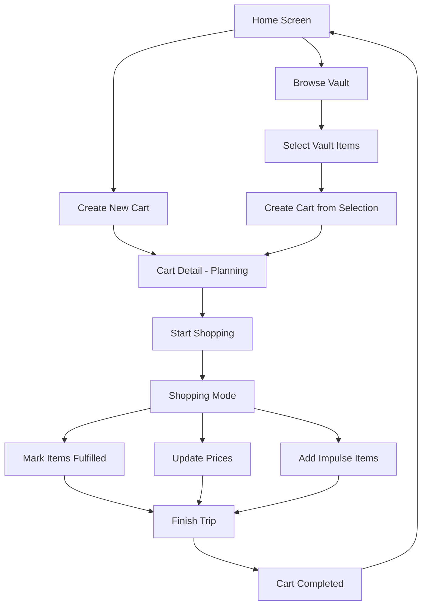

## 1. Product Overview

**Grock** is a privacy-first, offline-capable iOS grocery shopping companion that helps users manage their personal "Vault" of grocery items, plan shopping trips with budget estimates, and track actual spending in real-time. Unlike generic to-do lists, Grock remembers prices per store, allowing for accurate budget forecasting and shopping optimization.

The app targets iOS users who want intelligent grocery shopping with price tracking, budget control, and store-specific organization without requiring accounts or cloud services.

## 2. Core Features

### 2.1 User Roles
| Role | Registration Method | Core Permissions |
|------|---------------------|------------------|
| Single User | No registration required | Full access to all app features, local data only |

### 2.2 Feature Module
The Grock iOS app consists of the following main screens:

1. **Home Screen**: Dashboard showing active shopping carts, budget insights, and quick access to create new carts
2. **Vault Screen**: Personal grocery item database organized by categories with price history per store
3. **Cart Detail Screen**: Shopping list management with planning, shopping, and completed states
4. **Shopping Mode Screen**: Distraction-free interface for in-store shopping with real-time price tracking
5. **Menu Screen**: Settings, store management, app reset, and documentation access
6. **Onboarding Flow**: First-time user setup with welcome screens and initial item creation

### 2.3 Page Details

| Page Name | Module Name | Feature description |
|-----------|-------------|---------------------|
| Home Screen | Active Carts Display | Shows all active carts (planning/shopping) with budget progress, cart names, and creation dates |
| Home Screen | Cart Creation | Create new empty carts with custom names and budget amounts |
| Home Screen | Insights Panel | Display spending insights and budget overview for active carts |
| Vault Screen | Category Organization | Browse grocery items organized by predefined categories (Produce, Dairy, Meat, etc.) |
| Vault Screen | Item Search | Global search across all categories to find items by name |
| Vault Screen | Price History | View and manage price options per item for different stores |
| Vault Screen | Item Management | Add, edit, and delete grocery items with store-specific pricing |
| Cart Detail | Planning Mode | Add items from vault, set quantities, select stores, estimate total cost |
| Cart Detail | Shopping Mode | Mark items as fulfilled, update actual prices, add impulse items |
| Cart Detail | Budget Tracking | Visual progress bar showing planned vs actual spending |
| Cart Detail | Store Organization | Group items by store for efficient shopping routes |
| Shopping Mode | Item Fulfillment | Toggle items as picked up with haptic feedback and animations |
| Shopping Mode | Price Updates | Update actual prices when they differ from planned prices |
| Shopping Mode | Impulse Items | Add temporary shopping-only items not saved to vault |
| Menu Screen | Store Management | Add, rename, and delete stores used across the app |
| Menu Screen | App Settings | Reset app data, manage currencies, access documentation |
| Onboarding | Welcome Flow | Guide new users through app features and first item creation |

## 3. Core Process

### Primary User Flow: Plan → Shop → Complete

1. **Planning Phase**: User creates a new cart, sets a budget, and adds items from their Vault. The app automatically suggests prices based on historical data from selected stores.

2. **Shopping Phase**: User starts shopping mode, which provides a clean interface for checking off items as they're picked up. Prices can be updated in real-time if they differ from planned amounts.

3. **Completion Phase**: When finished shopping, the app updates the Vault with new prices and marks the cart as completed for historical tracking.

### Alternative Flows

- **Quick Cart Creation**: Create empty carts directly from Home screen and add items later
- **Vault-First Shopping**: Browse Vault items first, then create cart from selected items
- **Store-Specific Planning**: Organize shopping by store locations for efficient routes

## 4. User Interface Design

### 4.1 Design Style
- **Primary Colors**: System blue for interactive elements, green for success states
- **Secondary Colors**: Gray for disabled states, orange for warnings
- **Button Style**: Rounded rectangles with subtle shadows and haptic feedback
- **Typography**: System fonts (SF Pro) with dynamic type support for accessibility
- **Layout**: Card-based design with clear visual hierarchy and generous touch targets
- **Icons**: SF Symbols for consistency with iOS design language

### 4.2 Page Design Overview

| Page Name | Module Name | UI Elements |
|-----------|-------------|-------------|
| Home Screen | Active Carts | Card-based layout with budget progress bars, cart names in bold, creation dates in secondary text |
| Vault Screen | Category Grid | Circular category buttons with custom icons, scrollable item lists with price badges |
| Cart Detail | Planning View | Store-grouped item lists with quantity steppers, budget counter at top |
| Cart Detail | Shopping View | Large checkboxes for item fulfillment, prominent finish trip button |
| Shopping Mode | Full Screen | Minimal distractions, large tap targets, high contrast for visibility |

### 4.3 Responsiveness
- **Platform**: iOS-first design optimized for iPhone
- **Orientation**: Portrait primary, landscape supported with adaptive layouts
- **Device Support**: iPhone SE to iPhone Pro Max with scalable interfaces
- **Accessibility**: VoiceOver support, Dynamic Type, high contrast modes

### 4.4 Animation & Feedback
- **Haptic Feedback**: Subtle vibrations for item fulfillment and state changes
- **Celebrations**: Custom Lottie animations for first cart completion and milestones
- **Transitions**: Smooth spring animations for mode changes and navigation
- **Progress Indicators**: Animated budget bars and fulfillment percentages