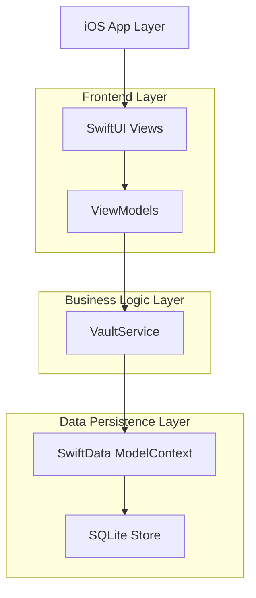
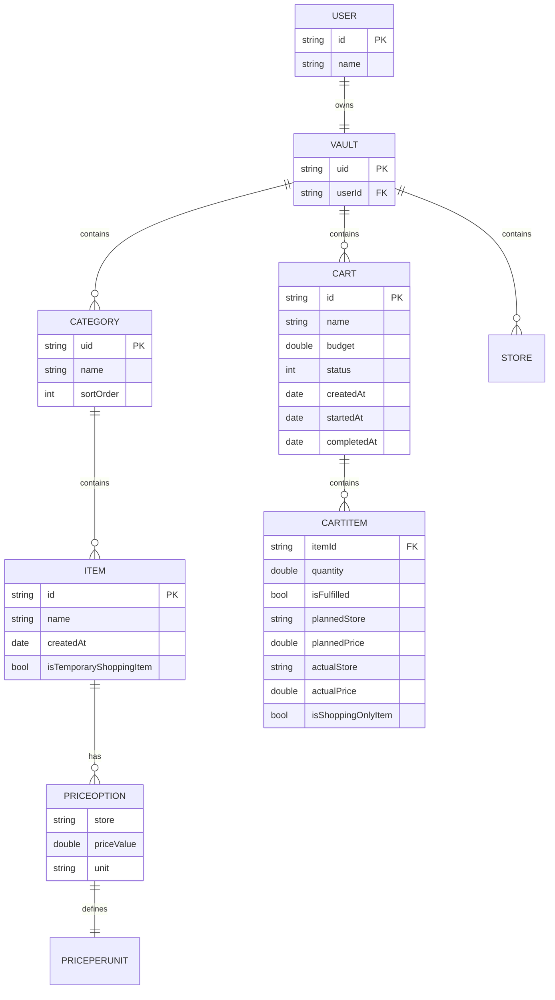
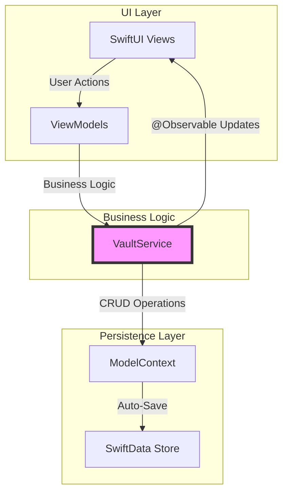
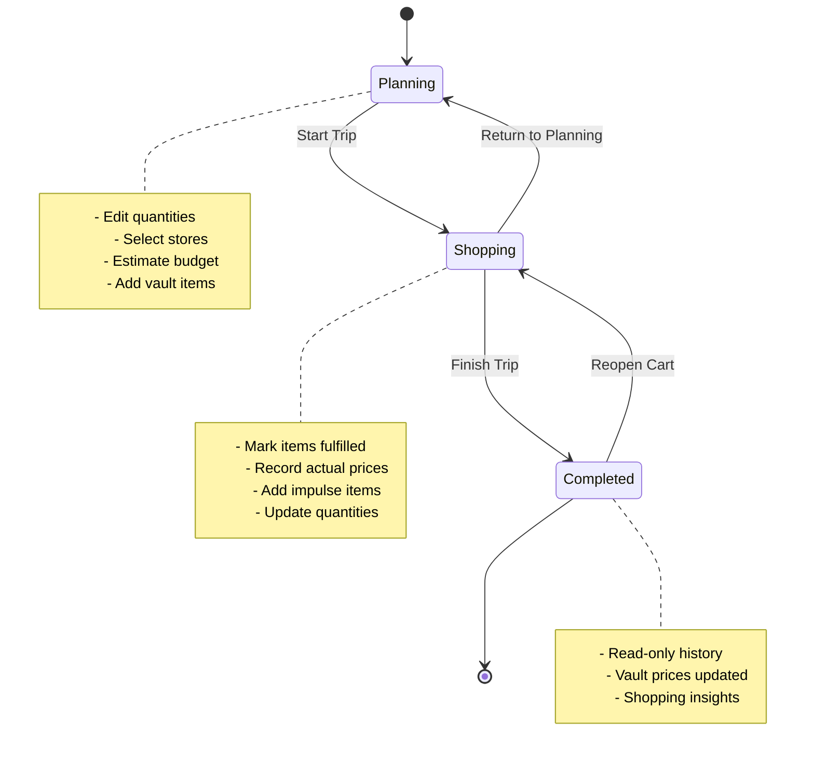

## 1. Architecture Design

Grock follows a **Modern SwiftUI Architecture** pattern with MVVM-S (Model-View-ViewModel-Service) design:



### Core Architecture Components

- **UI Framework**: SwiftUI with Observation (`@Observable`)
- **Data Persistence**: SwiftData with ModelContainer
- **State Management**: Environment-based dependency injection
- **Architecture Pattern**: MVVM-S (Model-View-ViewModel-Service)
- **Threading**: MainActor for UI updates

## 2. Technology Description

- **Frontend**: SwiftUI + Observation framework
- **Data Persistence**: SwiftData (iOS 17+)
- **Architecture**: MVVM-S pattern with service layer
- **Minimum iOS Version**: iOS 17
- **Development Environment**: Xcode 15+
- **Design System**: SF Symbols, Dynamic Type, Accessibility features

### Key Dependencies
- SwiftData for local persistence
- Observation framework for reactive UI
- UserDefaults for app state flags
- Lottie for animations (celebrations)

## 3. Route Definitions

| Route | Purpose |
|-------|---------|
| /home | Main dashboard showing active carts and insights |
| /vault | Personal grocery item database with categories |
| /cart/{id} | Shopping cart detail with planning/shopping modes |
| /shopping/{id} | Dedicated shopping mode interface |
| /menu | Settings and app management |
| /onboarding | First-time user setup flow |

## 4. Data Model Definitions

### 4.1 Core Entities



### 4.2 SwiftData Model Definitions

```swift
@Model
class User {
    var id: String
    var name: String
    @Relationship(deleteRule: .cascade) 
    var userVault: Vault
}

@Model
class Vault {
    @Attribute(.unique) var uid: String
    var categories: [Category] = []
    var carts: [Cart] = []
    var stores: [Store] = []
}

@Model
class Category {
    var uid: String
    var name: String
    var sortOrder: Int
    @Relationship(deleteRule: .cascade)
    var items: [Item] = []
}

@Model
class Item {
    @Attribute(.unique) var id: String
    var name: String
    var priceOptions: [PriceOption] = []
    var createdAt: Date
    var isTemporaryShoppingItem: Bool?
}

@Model
class Cart {
    @Attribute(.unique) var id: String
    var name: String
    var budget: Double
    var status: CartStatus
    var createdAt: Date
    var startedAt: Date?
    var completedAt: Date?
    @Relationship(deleteRule: .cascade)
    var cartItems: [CartItem] = []
}

@Model
class CartItem {
    var itemId: String
    var quantity: Double
    var isFulfilled: Bool
    var plannedStore: String
    var plannedPrice: Double?
    var plannedUnit: String?
    var actualStore: String?
    var actualPrice: Double?
    var actualQuantity: Double?
    var actualUnit: String?
    var isShoppingOnlyItem: Bool
    var isSkippedDuringShopping: Bool
    var wasEditedDuringShopping: Bool
}
```

## 5. Service Layer Architecture

### 5.1 VaultService Responsibilities

```mermaid
graph TD
    A[VaultService] --> B[User Management]
    A --> C[Category Operations]
    A --> D[Item Management]
    A --> E[Store Management]
    A --> F[Cart Lifecycle]
    A --> G[Shopping Operations]
    A --> H[Data Validation]
    
    B --> B1[Load/Creation]
    B --> B2[Name Updates]
    
    C --> C1[Pre-populate Defaults]
    C --> C2[CRUD Operations]
    C --> C3[Sort Order Management]
    
    D --> D1[Add/Update/Delete]
    D --> D2[Duplicate Validation]
    D --> D3[Price Option Management]
    D --> D4[Search Operations]
    
    E --> E1[Store CRUD]
    E --> E2[Store Renaming]
    E --> E3[Recent Store Tracking]
    
    F --> F1[Create/Delete Carts]
    F --> F2[Status Transitions]
    F --> F3[Budget Management]
    F --> F4[Cart Insights]
    
    G --> G1[Start Shopping]
    G --> G2[Complete Shopping]
    G --> G3[Return to Planning]
    G --> G4[Item Fulfillment]
    G --> G5[Shopping-Only Items]
    
    H --> H1[Name Validation]
    H --> H2[Duplicate Detection]
    H --> H3[Data Integrity]
```



### 5.2 Key Service Methods

#### Cart Lifecycle Management
- `createCart(name:budget:)` - Create new shopping cart
- `startShopping(cart:)` - Transition cart to shopping mode
- `completeShopping(cart:)` - Finalize shopping and update vault
- `returnToPlanning(cart:)` - Reset cart to planning state

#### Item Operations
- `addItem(name:to:store:price:unit:)` - Add new grocery item
- `updateItem(item:newName:newCategory:newStore:newPrice:newUnit:)` - Update existing item
- `findItemById(_:)` - Retrieve item by ID (handles shopping-only items)
- `findItemsByName(_:)` - Search items by name

#### Shopping Operations
- `addVaultItemToCart(item:cart:quantity:)` - Add vault item to cart
- `addShoppingItemToCart(name:store:price:unit:cart:)` - Add temporary shopping item
- `toggleItemFulfillment(cart:itemId:)` - Mark item as picked up
- `updateCartItemActualData(cart:itemId:actualPrice:actualQuantity:actualUnit:actualStore:)` - Update shopping data

## 6. ViewModel Architecture

### 6.1 ViewModel Responsibilities

```mermaid
graph TD
    A[ViewModels] --> B[HomeViewModel]
    A --> C[CartDetailViewModel]
    A --> D[CartViewModel]
    A --> E[OnboardingViewModel]
    A --> F[ItemFormViewModel]
    
    B --> B1[Cart Management]
    B --> B2[Navigation State]
    B --> B3[UI Animations]
    B --> B4[Vault Integration]
    
    C --> C1[Cart State Management]
    C --> C2[Shopping Mode Logic]
    C --> C3[Item Operations]
    C --> C4[Filter Management]
    C --> C5[Celebration Triggers]
    
    D --> D1[Cart CRUD Operations]
    D --> D2[State Filtering]
    D --> D3[Validation Logic]
    
    E --> E1[Onboarding Flow]
    E --> E2[First Item Creation]
    E --> E3[Store Setup]
    
    F --> F1[Form Validation]
    F --> F2[Price Management]
    F --> F3[Category Selection]
```



### 6.2 State Management Pattern

- **Observable Objects**: All ViewModels use `@Observable` for reactive UI updates
- **Environment Injection**: Services injected via `.environment()` modifier
- **State Co-location**: UI state managed within ViewModels, not in Views
- **Single Source of Truth**: VaultService maintains all data mutations

## 7. Data Flow Architecture

### 7.1 Application Data Flow



### 7.2 Shopping Trip State Machine



## 8. Key Architectural Decisions

### 8.1 Data Persistence Strategy
- **SwiftData**: Chosen over Core Data for iOS 17+ modern API
- **Local-First**: All data stored locally, no cloud synchronization
- **Migration Strategy**: Safe fallbacks with optional fields for backward compatibility

### 8.2 State Management Approach
- **Environment-Based DI**: Services injected via SwiftUI environment, not singletons
- **Observable Pattern**: Reactive UI updates using `@Observable` framework
- **Service Layer**: Centralized business logic in VaultService for consistency

### 8.3 Shopping Mode Design
- **Shopping-Only Items**: Temporary items not saved to vault for impulse purchases
- **Price Tracking**: Automatic vault updates with actual shopping prices
- **State Preservation**: Original planning quantities preserved for restoration

### 8.4 Error Handling Strategy
- **Validation Layer**: Input validation in VaultService before data mutations
- **Graceful Degradation**: Safe fallbacks for missing data or failed operations
- **User Feedback**: Clear error messages for validation failures

## 9. Extension Points

### 9.1 Future Features
- **Insights Dashboard**: Spending analytics and price trend tracking
- **Export Functionality**: Shopping list and receipt export capabilities
- **Store Mapping**: Location-based store suggestions and route optimization
- **Price Alerts**: Notifications for significant price changes

### 9.2 Plugin Architecture
- **Currency Support**: Pluggable currency management system
- **Theme System**: Customizable UI themes and color schemes
- **Analytics**: Optional usage analytics with user consent

## 10. Performance Considerations

### 10.1 Data Optimization
- **Lazy Loading**: SwiftData's built-in lazy loading for large datasets
- **Query Optimization**: Efficient fetch descriptors for common operations
- **Memory Management**: Proper model context lifecycle management

### 10.2 UI Performance
- **List Optimization**: Efficient SwiftUI list rendering with identifiers
- **Animation Performance**: Optimized transitions and celebration animations
- **State Updates**: Minimal observable updates to prevent unnecessary re-renders