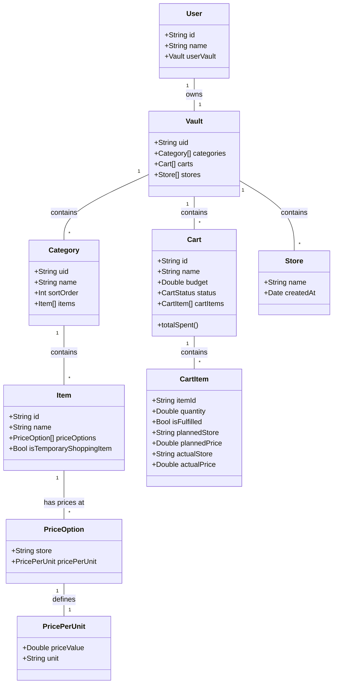
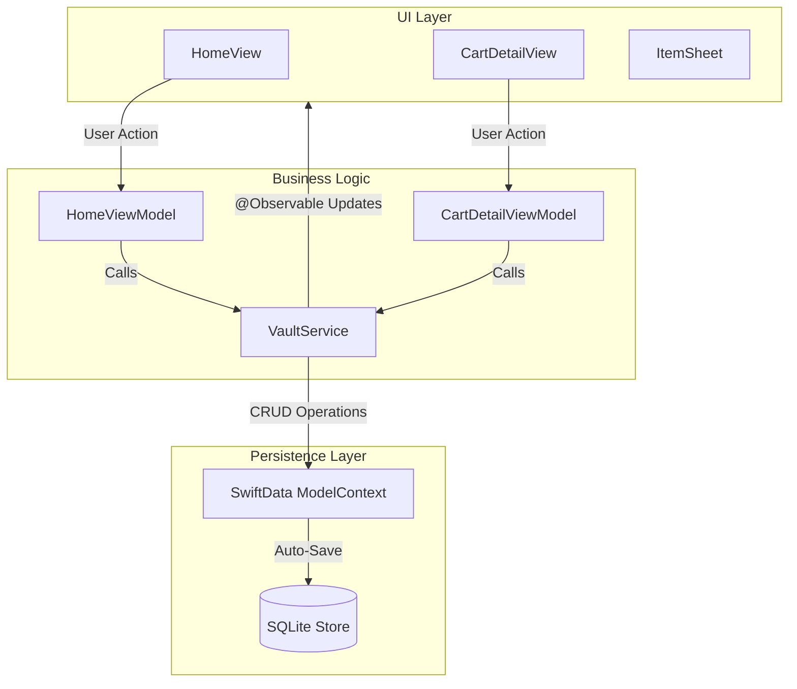
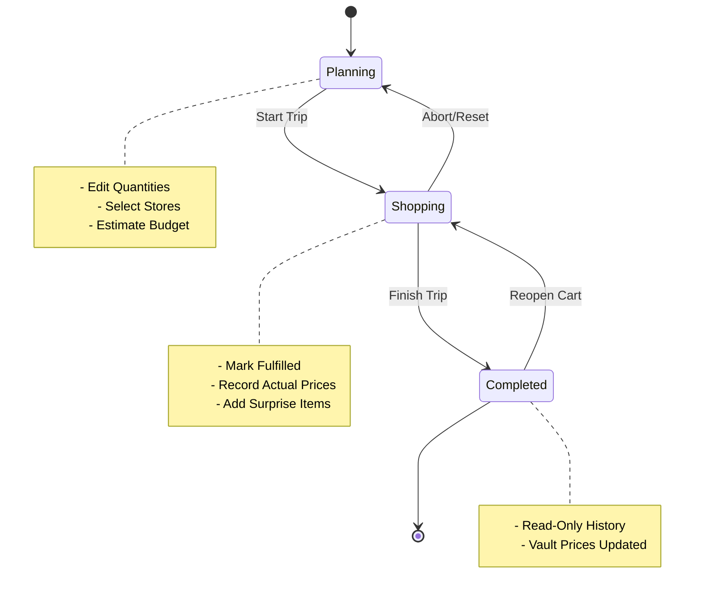

# Grock Technical Architecture

This document outlines the technical architecture of the Grock application. It includes data models, service layer responsibilities, and data flow diagrams.

## 1. High-Level Architecture

Grock follows a **Modern SwiftUI Architecture** pattern:

- **UI Framework:** SwiftUI
- **Data Persistence:** SwiftData
- **State Management:** Observation (`@Observable`)
- **Architecture Pattern:** MVVM-S (Model-View-ViewModel-Service)

### Core Components

- **Views:** Declarative UI components.
- **ViewModels:** Handle view-specific logic and state (e.g., `CartDetailViewModel`, `HomeViewModel`).
- **Services:** `VaultService` acts as the singleton-like source of truth for domain logic and data persistence.
- **Models:** SwiftData entities defining the schema.

---

## 2. Data Model Diagram

The following class diagram illustrates the SwiftData entities and their relationships.



---

## 3. Application Data Flow

Grock uses `VaultService` as the central hub for data mutations. Views do not modify SwiftData models directly; they request changes via `VaultService`.



---

## 4. Key Workflows

### Shopping Trip Lifecycle

The core feature of Grock is the transition of a Cart from **Planning** to **Shopping** to **Completed**.



## 5. Directory Structure

```text
Grock/
├── App/                # App entry point and dependency injection
├── Core/               # Feature modules
│   ├── Detail Cart/    # Shopping list and execution views
│   ├── Home/           # Dashboard and cart management
│   ├── Menu/           # Settings and app navigation
│   ├── Onboarding/     # First-time user experience
│   └── Vault/          # Item and category management
├── Models/             # SwiftData entity definitions
├── Service/            # VaultService and business logic
└── Utils/              # Helpers and extensions
```
